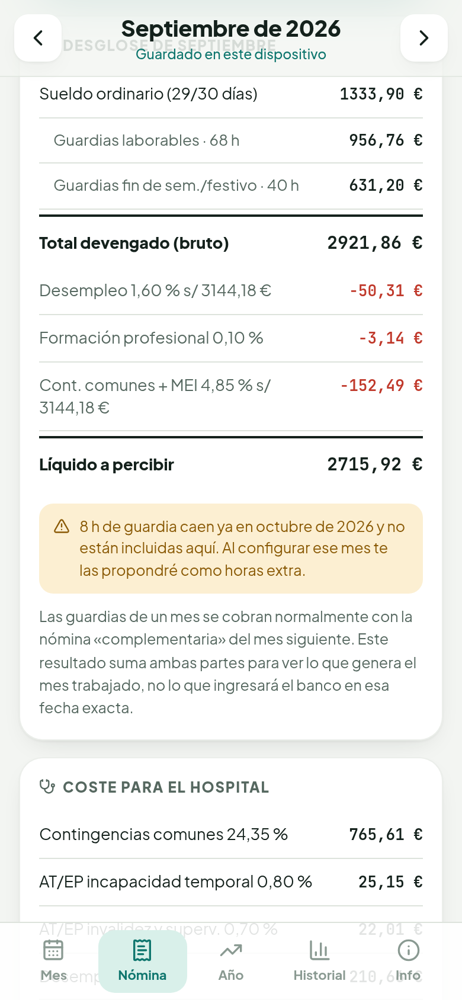
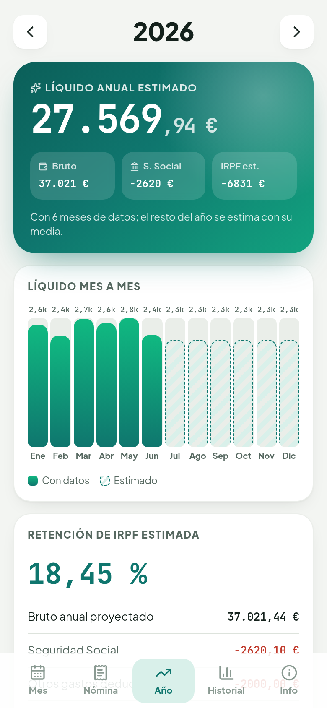
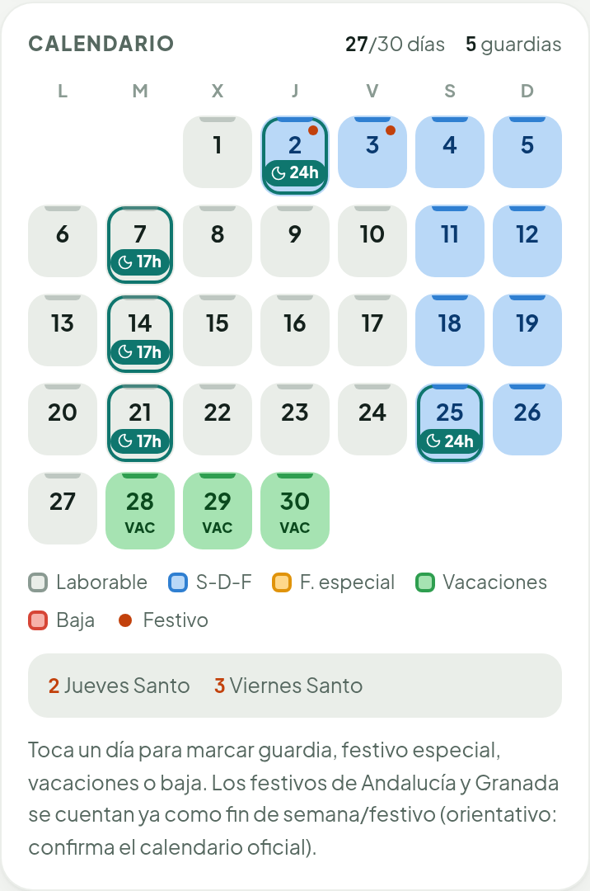
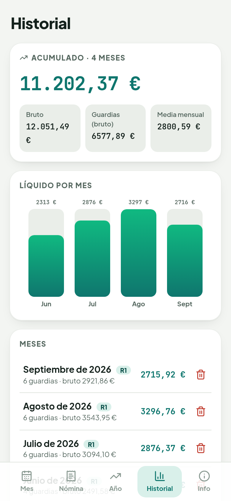
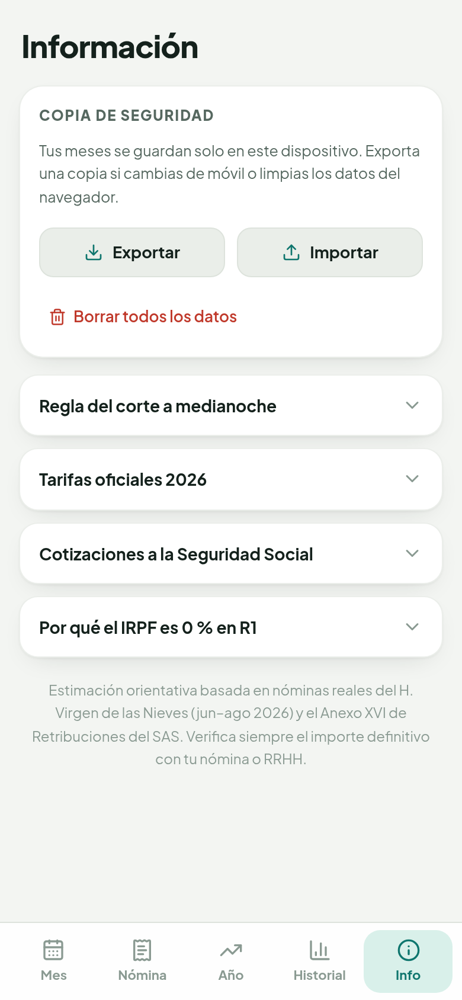

# Sueldo Resi

Calculadora de nómina para **residentes MIR del SAS** (H. Virgen de las Nieves, Granada). Marca tus guardias,
vacaciones y bajas en un calendario y ve al momento el bruto, las cotizaciones y el líquido de cada mes, con las
tarifas del Anexo XVI de Retribuciones del SAS.

**[Abrir la app →](https://marodseg.github.io/calculadora-sueldo-resi/)**

<p align="center">
  
  
  
  
</p>

## Qué hace

- **Calendario táctil.** Toca un día para marcar guardia (17 h, 24 h o a medida), festivo, festivo especial,
  vacaciones o baja.
- **Regla del corte a medianoche.** Una guardia se reparte entre el día de inicio y el siguiente, cada parte a su
  tarifa. Si empieza el último día del mes, las horas que caen en el mes siguiente se proponen como horas extra al
  configurarlo.
- **Nómina completa.** Sueldo ordinario prorrateado, complemento de formación, guardias, base mínima de cotización
  del grupo 1, desempleo, formación profesional, contingencias comunes + MEI e IRPF (0 % en R1, manual o estimado
  desde R2). Incluye el coste para el hospital.
- **Un mes, una configuración.** Cada mes se guarda por separado; los meses nuevos heredan el año de residencia y el
  IRPF del anterior.
- **Festivos de Andalucía y Granada.** Se cuentan por defecto como fin de semana/festivo: Año Nuevo, Reyes, Día de
  Andalucía, Jueves y Viernes Santo, Corpus de Granada, la Toma y el resto, con traslado al lunes cuando caen en
  domingo. Se pueden cambiar día a día. Son orientativos: confirma el calendario oficial (BOJA).
- **Vista anual y proyección del IRPF.** Suma los meses que has guardado, estima el resto del año con su media y
  calcula la retención de IRPF siguiendo el esquema de retenciones de la AEAT para un soltero sin hijos (Seguridad Social, gastos
  deducibles, reducción por rendimientos del trabajo y escala progresiva). Desde el mes puedes copiar ese
  porcentaje con «Estimar».
- **Historial.** Gráfico del líquido por mes, acumulado y media mensual.
- **App instalable (PWA).** Añádela a la pantalla de inicio y funciona sin conexión; te avisa cuando hay una
  versión nueva.
- **Copia de seguridad.** Exportar e importar todos tus meses en un archivo JSON.
- Mobile-first, modo claro y oscuro automático, accesible por teclado y respetuoso con `prefers-reduced-motion`.

<p align="center">
  
  
  
  
</p>

## Privacidad

No hay backend, cuentas ni analítica. Todo se calcula y se guarda en tu propio navegador; nada sale de tu
dispositivo. Por eso, si cambias de móvil o borras los datos del navegador, usa **Info → Exportar** antes.

## Stack

| Área        | Tecnología                                                                 |
| ----------- | -------------------------------------------------------------------------- |
| Framework   | React 19 + TypeScript (estricto) + Vite                                    |
| Componentes | Radix UI (accesibles y sin estilos), vaul (bottom sheet), sonner           |
| Iconos      | lucide-react                                                               |
| Animaciones | framer-motion (`LazyMotion`)                                               |
| Estilos     | CSS propio con variables, sin framework                                    |
| Calidad     | Vitest, ESLint (typescript-eslint + react-hooks), Prettier, GitHub Actions |

## Estructura

```
src/
├── lib/                  # Lógica pura, sin React (fácil de testear)
│   ├── rates.ts          # Tarifas y porcentajes oficiales
│   ├── calc.ts           # Cálculo de la nómina y reparto de guardias
│   ├── holidays.ts       # Festivos de Andalucía y Granada (Semana Santa, traslados…)
│   ├── irpf.ts           # Estimación de la retención de IRPF
│   ├── year.ts           # Proyección del año natural a partir de los meses guardados
│   ├── storage.ts        # Persistencia en localStorage + validación de datos importados
│   ├── useStore.ts       # Estado de la app (meses, mes activo, acciones)
│   └── *.test.ts
├── components/           # UI: una pantalla o tarjeta por archivo
└── App.tsx               # Pestañas y composición
```

La lógica de negocio vive en `src/lib/calc.ts` como funciones puras: recibe la configuración de un mes y devuelve los
totales. Las tarifas están aparte, en `src/lib/rates.ts`, para actualizarlas cada año sin tocar el cálculo.

## Desarrollo

Requiere Node 20 o superior.

```bash
npm install
npm run dev           # servidor de desarrollo
npm test              # tests de la lógica (cálculo, festivos, IRPF, proyección) y del almacenamiento
npm run lint          # ESLint
npm run format        # Prettier
npm run build         # comprobación de tipos + build de producción en dist/
```

## Despliegue

Cada push a `main` ejecuta lint, tests y build en GitHub Actions y publica `dist/` en GitHub Pages
(`.github/workflows/deploy.yml`). El build usa rutas relativas, así que funciona bajo cualquier subruta.

## Aviso

Es una estimación **orientativa**, basada en nóminas reales de junio a agosto de 2026 y en el Anexo XVI de
Retribuciones del SAS. El IRPF a partir de R2 depende de tu situación personal. Verifica siempre el importe
definitivo con tu nómina o con RRHH.

## Licencia

[MIT](LICENSE)
